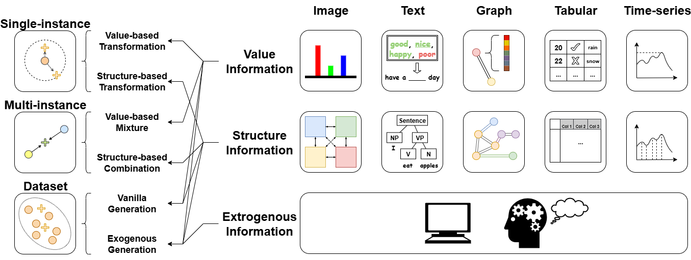

# Awesome-Data-Augmentation

 

This is the repo of "A Comprehensive Survey on Data Augmentation"

## Introduction

### What is Data Augmentation 

Data augmentation is a series of techniques that generate high-quality artificial data by manipulating existing data samples. By leveraging data augmentation techniques, AI models can achieve significantly improved applicability in tasks involving scarce or imbalanced datasets, thereby substantially enhancing AI models' generalization capabilities. 

### The Gap of Current Reviews 

Existing literature surveys only focus on a certain type of specific modality data, and categorize these methods from modality-specific and operation-centric perspectives, which lacks a consistent summary of data augmentation methods across multiple modalities and limits the comprehension of how existing data samples serve the data augmentation process. 

### Summary of this Survey

This survey proposes a novel, unified taxonomy from a data-centric perspective that focuses on how data augmentation leverages information from samples, accommodating all modalities consistently and inductively.
It covers 200+ data augmentation methods designed for five data modalities and categorizes them under the proposed taxonomy. 
By identifying a unified, data-centric philosophy underlying augmentation methods across modalities, this survey provides a novel conceptual framework for understanding the field.

## Existing Surveys on Data Augmentation

| Year | Title | Venue | Modality | Paper |
|:--------:|----------|----------|:--------:|:--------:|
|2018|Data Augmentation for Improving Deep Learning in Image Classification Problem|International Interdisciplinary PhD Workshop (IIPhDW)|Image|[Link](https://ieeexplore.ieee.org/document/8388338)|
|2019|A Survey on Image Data Augmentation for Deep Learning|Journal of Big Data|Imgae|[Link](https://journalofbigdata.springeropen.com/articles/10.1186/s40537-019-0197-0)|
|          |          |          |          |          |

## The Proposed Taxonomy

## Data Augmentation Literature

### Single-instance Level Data Augmentation

#### Value-based Transformation

| Name | Year | Venue | Paper | Code | Modality |
|------|:----:|:-----:|:-----:|:----:|:--------:|
|Improved regularization of convolutional neural networks with cutout|2017|arXiv|[Link](https://arxiv.org/abs/1708.04552)|[Link](https://github.com/uoguelph-mlrg/Cutout)|Image

#### Structure-based Transformation

| Name | Year | Venue | Paper | Code | Modality |
|------|:----:|:-----:|:-----:|:----:|:--------:|
|Automatic image cropping for mobile device with built-in camera|2004|CCNC|[Link](https://ieeexplore.ieee.org/abstract/document/1286964)||Image|

#### Value-structure Transformation

| Name | Year | Venue | Paper | Code | Modality |
|------|:----:|:-----:|:-----:|:----:|:--------:|
|Diversity-oriented data augmentation with large language models|2025|ACL|[Link](https://aclanthology.org/2025.acl-long.1084/)|[Link](https://github.com/CNICDS/DoAug)|Text|

### Multi-instance Level Data Augmentation

#### Value-based Mixture

| Name | Year | Venue | Paper | Code | Modality |
|------|:----:|:-----:|:-----:|:----:|:--------:|
|mixup: Beyond empirical risk minimization|2018|ICLR|[Link](https://openreview.net/forum?id=r1Ddp1-Rb)|[Link](https://github.com/facebookresearch/mixup-cifar10)|Image,Tabular|

#### Structure-based Combination

| Name | Year | Venue | Paper | Code | Modality |
|------|:----:|:-----:|:-----:|:----:|:--------:|
|Data augmentation using random image cropping and patching for deep CNNs|2019|TCSVT|[Link](https://ieeexplore.ieee.org/abstract/document/8795523)|[Link](https://github.com/jackryo/ricap)|Image|

#### Value-structure Mixture

| Name | Year | Venue | Paper | Code | Modality |
|------|:----:|:-----:|:-----:|:----:|:--------:|
|Automix: Unveiling the power of mixup for stronger classifiers|2022|ECCV|[Link](https://link.springer.com/chapter/10.1007/978-3-031-20053-3_26)|[Link](https://github.com/Westlake-AI/openmixup)|Image|

### Dataset Level Data Augmentation

#### Vanilla Generation

| Name | Year | Venue | Paper | Code | Modality |
|------|:----:|:-----:|:-----:|:----:|:--------:|
|Deep learning with small datasets: using autoencoders to address limited datasets in construction management|2021|Applied Soft Computing|[Link](https://www.sciencedirect.com/science/article/abs/pii/S1568494621007584)||Tabular|

#### Exogenous Generation

| Name | Year | Venue | Paper | Code | Modality |
|------|:----:|:-----:|:-----:|:----:|:--------:|
|Image style transfer using convolutional neural networks|2016|CVPR|[Link](https://ieeexplore.ieee.org/document/7780634)||Image|
