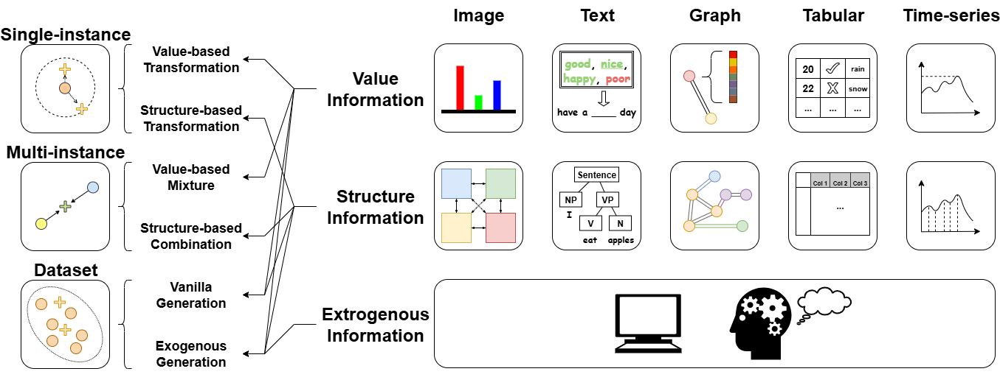

# Awesome-Data-Augmentation

 

This is the repo of "A Comprehensive Survey on Data Augmentation"

## Introduction

### What is Data Augmentation 

Data augmentation is a series of techniques that generate high-quality artificial data by manipulating existing data samples. By leveraging data augmentation techniques, AI models can achieve significantly improved applicability in tasks involving scarce or imbalanced datasets, thereby substantially enhancing AI models' generalization capabilities. 

### The Gap of Current Reviews 

Existing literature surveys only focus on a certain type of specific modality data, and categorize these methods from modality-specific and operation-centric perspectives, which lacks a consistent summary of data augmentation methods across multiple modalities and limits the comprehension of how existing data samples serve the data augmentation process. 

### Summary of this Survey

This survey proposes a novel, unified taxonomy from a data-centric perspective that focuses on how data augmentation leverages information from samples, accommodating all modalities consistently and inductively.
It covers 200+ data augmentation methods designed for five data modalities and categorizes them under the proposed taxonomy. 
By identifying a unified, data-centric philosophy underlying augmentation methods across modalities, this survey provides a novel conceptual framework for understanding the field.

## Existing Surveys on Data Augmentation

| Year | Title | Venue | Modality | Paper |
|:--------:|----------|----------|:--------:|:--------:|
|2018|Data Augmentation for Improving Deep Learning in Image Classification Problem|International Interdisciplinary PhD Workshop (IIPhDW)|Image|[Link](https://ieeexplore.ieee.org/document/8388338)|
|2019|A Survey on Image Data Augmentation for Deep Learning|Journal of Big Data|Image|[Link](https://journalofbigdata.springeropen.com/articles/10.1186/s40537-019-0197-0)|
|2021|A Survey of Data Augmentation Approaches for NLP|Findings of ACL|Text||
|2021|Text Data Augmentation for Deep Learning|Journal of Big Data|Text||
|2021|Time Series Data Augmentation for Deep Learning: A Survey|IJCAI|Time-series||
|2021|An Empirical Survey of Data Augmentation for Time Series Classification with Neural Networks|PLOS ONE|Time-series||
|2022|A Comprehensive Survey of Recent Trends in Deep Learning for Digital Images Augmentation|Artificial Intelligence Review|Image||
|2022|Data Augmentation: A Comprehensive Survey of Modern Approaches|Array|Image||
|2022|A Survey on Data Augmentation for Text Classification|ACM Computing Surveys|Text||
|2022|Data Augmentation for Deep Graph Learning: A Survey|ACM SIGKDD Explorations|Graph||
|2022|Graph Data Augmentation for Graph Machine Learning: A Survey|arXiv|Graph||
|2022|Data Augmentation on Graphs: A Survey|arXiv|Graph||
|2022|Deep Neural Networks and Tabular Data: A Survey|IEEE TNNLS|Tabular||
|2022|The Use of Generative Adversarial Networks to Alleviate Class Imbalance in Tabular Data: A Survey|Journal of Big Data|Tabular||
|2023|Tabular and Latent Space Synthetic Data Generation: A Literature Review|Journal of Big Data|Tabular||
|2023|Data Augmentation Techniques in Time Series Domain: A Survey and Taxonomy|Neural Computing and Applications|Time-series||
|2024|Tabular Data Augmentation for Machine Learning: Progress and Prospects of Embracing Generative AI|arXiv|Tabular||
|2024|A Survey on Data Synthesis and Augmentation for Large Language Models|arXiv|Text||
|2025|Image, Text, and Speech Data Augmentation using Multimodal LLMs for Deep Learning: A Survey|arXiv|Multimodal||

## The Proposed Taxonomy

## Data Augmentation Literature

### Single-instance Level Data Augmentation

#### Value-based Transformation

| Name | Year | Venue | Paper | Code | Modality |
|------|:----:|:-----:|:-----:|:----:|:--------:|
|Improved regularization of convolutional neural networks with cutout|2017|arXiv|[Link](https://arxiv.org/abs/1708.04552)|[Link](https://github.com/uoguelph-mlrg/Cutout)|Image|
|Random erasing data augmentation|2020|AAAI|[Link](https://arxiv.org/abs/1708.04896)||Image|
|Hide-and-seek: Forcing a network to be meticulous for weakly-supervised object and action localization|2017|ICCV|[Link](https://arxiv.org/abs/1704.04232)||Image|
|GridMask data augmentation|2020|arXiv|[Link](https://arxiv.org/abs/2001.04086)||Image|
|Improving corruption robustness with random erasing in the frequency domain|2023|ICEIC|||Image|
|A simple and effective histogram equalization approach to image enhancement|2004|Digital Signal Processing|||Image|
|EDA: Easy data augmentation techniques for boosting performance on text classification tasks|2019|EMNLP|[Link](https://aclanthology.org/D19-1670/)||Text|
|Improving short text classification through global augmentation methods|2020|CD-MAKE|||Text|
|Augmenting neural machine translation with knowledge graphs|2019|arXiv|[Link](https://arxiv.org/abs/1902.08816)||Text|
|AEDA: An easier data augmentation technique for text classification|2021|Findings of EMNLP|[Link](https://aclanthology.org/2021.findings-emnlp.247/)||Text|
|Data noising as smoothing in neural network language models|2017|arXiv|[Link](https://arxiv.org/abs/1703.02573)||Text|
|Syntax-aware data augmentation for neural machine translation|2023|IEEE/ACM TASLP|||Text|
|Graph contrastive learning with augmentations|2020|NeurIPS|[Link](https://arxiv.org/abs/2010.13902)||Graph|
|Graph random neural networks for semi-supervised learning on graphs|2020|NeurIPS|[Link](https://arxiv.org/abs/2005.11079)||Graph|
|Large-scale representation learning on graphs via bootstrapping|2021|ICLR|[Link](https://arxiv.org/abs/2102.06514)||Graph|
|Graph adversarial self-supervised learning|2021|NeurIPS|[Link](https://arxiv.org/abs/2110.07860)||Graph|
|Topological regularization for graph neural networks augmentation|2021|arXiv|[Link](https://arxiv.org/abs/2104.02478)||Graph|
|Local augmentation for graph neural networks|2022|ICML|[Link](https://arxiv.org/abs/2109.03856)||Graph|
|DropMessage: Unifying random dropping for graph neural networks|2023|AAAI|[Link](https://arxiv.org/abs/2302.14679)||Graph|
|VIME: Extending the success of self- and semi-supervised learning to tabular domain|2020|NeurIPS|[Link](https://arxiv.org/abs/2008.09497)||Tabular|
|SCARF: Self-supervised contrastive learning using random feature corruption|2021|ICLR|[Link](https://arxiv.org/abs/2106.02747)||Tabular|
|MET: Masked encoding for tabular data|2022|arXiv|[Link](https://arxiv.org/abs/2206.08564)||Tabular|
|FastFT: Accelerating reinforced feature transformation via advanced exploration strategies|2025|arXiv|[Link](https://arxiv.org/abs/2503.20394)||Tabular|
|Collaborative multi-agent reinforcement learning for automated feature transformation with graph-driven path optimization|2025|arXiv|[Link](https://arxiv.org/abs/2504.17355)||Tabular|
|Traceable automatic feature transformation via cascading actor-critic agents|2023|SDM|||Tabular|
|Reinforcement-enhanced autoregressive feature transformation|2023|NeurIPS|||Tabular|
|Dynamic and adaptive feature generation with LLM|2024|arXiv|[Link](https://arxiv.org/abs/2406.03505)||Tabular|
|TIFG: Text-informed feature generation with large language models|2024|IEEE BigData|||Tabular|
|TFWT: Tabular feature weighting with transformer|2024|arXiv|[Link](https://arxiv.org/abs/2405.08403)||Tabular|
|Data augmentation of wearable sensor data for Parkinson's disease monitoring using convolutional neural networks|2017|ICMI|||Time-series|
|RobustTAD: Robust time series anomaly detection via decomposition and convolutional neural networks|2020|arXiv|[Link](https://arxiv.org/abs/2002.09545)||Time-series|
|RobustSTL: A robust seasonal-trend decomposition algorithm for long time series|2019|AAAI|[Link](https://arxiv.org/abs/1810.09450)||Time-series|
|Data augmentation using empirical mode decomposition on neural networks to classify impact noise in vehicle|2020|ICASSP|||Time-series|

#### Structure-based Transformation

| Name | Year | Venue | Paper | Code | Modality |
|------|:----:|:-----:|:-----:|:----:|:--------:|
|Automatic image cropping for mobile device with built-in camera|2004|CCNC|[Link](https://ieeexplore.ieee.org/abstract/document/1286964)||Image|
|Gaze-based interaction for semi-automatic photo cropping|2006|CHI|||Image|
|Sensation-based photo cropping|2009|ACM Multimedia|||Image|
|Learning to photograph|2010|ACM Multimedia|||Image|
|Probabilistic graphlet transfer for photo cropping|2012|IEEE TIP|||Image|
|Learning the change for automatic image cropping|2013|CVPR|||Image|
|Automatic image cropping: A computational complexity study|2016|CVPR|||Image|
|A2-RL: Aesthetics aware reinforcement learning for image cropping|2018|CVPR|||Image|
|Best practices for convolutional neural networks applied to visual document analysis|2003|ICDAR|||Image|
|Optimized scale-and-stretch for image resizing|2008|SIGGRAPH Asia|||Image|
|Spatial transformer networks|2015|NeurIPS|[Link](https://arxiv.org/abs/1506.02025)||Image|
|PatchShuffle regularization|2017|arXiv|[Link](https://arxiv.org/abs/1707.07103)||Image|
|Perspective transformation data augmentation for object detection|2019|IEEE Access|||Image|
|Data augmentation via dependency tree morphing for low-resource languages|2018|EMNLP|[Link](https://aclanthology.org/D18-1545/)||Text|
|Syntactic data augmentation increases robustness to inference heuristics|2020|ACL|[Link](https://aclanthology.org/2020.acl-main.212/)||Text|
|Neural message passing for quantum chemistry|2017|ICML|||Graph|
|DropEdge: Towards deep graph convolutional networks on node classification|2019|ICLR|[Link](https://arxiv.org/abs/1907.10903)||Graph|
|FairDrop: Biased edge dropout for enhancing fairness in graph representation learning|2021|IEEE TAI|[Link](https://arxiv.org/abs/2106.01272)||Graph|
|Adversarial graph augmentation to improve graph contrastive learning|2021|NeurIPS|[Link](https://arxiv.org/abs/2106.05860)||Graph|
|GCC: Graph contrastive coding for graph neural network pre-training|2020|KDD|[Link](https://arxiv.org/abs/2006.09963)||Graph|
|GraphCrop: Subgraph cropping for graph classification|2020|arXiv|[Link](https://arxiv.org/abs/2009.10564)||Graph|
|Sub-graph contrast for scalable self-supervised graph representation learning|2020|ICDM|||Graph|
|Robust graph representation learning via neural sparsification|2020|ICML|||Graph|
|SUGAR: Subgraph neural network with reinforcement pooling and self-supervised mutual information mechanism|2021|WWW|||Graph|
|MoCL: Data-driven molecular fingerprint via knowledge-aware contrastive learning|2021|KDD|||Graph|
|Graph rationalization with environment-based augmentations|2022|KDD|||Graph|
|Diffusion improves graph learning|2019|NeurIPS|[Link](https://arxiv.org/abs/1911.05485)||Graph|
|Contrastive multi-view representation learning on graphs|2020|ICML|[Link](https://arxiv.org/abs/2006.05582)||Graph|
|Multi-scale contrastive siamese networks for self-supervised graph representation learning|2021|arXiv|[Link](https://arxiv.org/abs/2105.05682)||Graph|
|Self-supervised graph neural networks without explicit negative sampling|2021|arXiv|[Link](https://arxiv.org/abs/2103.14958)||Graph|
|Mitigation of malicious attacks on networks|2011|PNAS|||Graph|
|Smart rewiring for network robustness|2013|Journal of Complex Networks|||Graph|
|Understanding over-squashing and bottlenecks on graphs via curvature|2021|ICLR|[Link](https://arxiv.org/abs/2011.14505)||Graph|
|DiffWire: Inductive graph rewiring via the Lovász bound|2022|LoG|||Graph|
|Make heterophily graphs better fit GNN: A graph rewiring approach|2022|arXiv|[Link](https://arxiv.org/abs/2209.08264)||Graph|
|Homophily-oriented heterogeneous graph rewiring|2023|WWW|||Graph|
|SubTab: Subsetting features of tabular data for self-supervised representation learning|2021|NeurIPS|[Link](https://arxiv.org/abs/2106.08201)||Tabular|
|Multi-scale convolutional neural networks for time series classification|2016|arXiv|[Link](https://arxiv.org/abs/1603.06995)||Time-series|
|Vocal tract length perturbation (VTLP) improves speech recognition|2013|ICML Workshop|||Time-series|
|Data augmentation for time series classification using convolutional neural networks|2016|ECML/PKDD Workshop|||Time-series|
|Feature representation and data augmentation for human activity classification based on wearable IMU sensor data using a deep LSTM neural network|2018|Sensors|||Time-series|
|Data augmentation based on vowel stretch for improving children's speech recognition|2019|ASRU|||Time-series|
|SpecAugment: A simple data augmentation method for automatic speech recognition|2019|arXiv|[Link](https://arxiv.org/abs/1904.08779)||Time-series|

#### Value-structure Transformation

| Name | Year | Venue | Paper | Code | Modality |
|------|:----:|:-----:|:-----:|:----:|:--------:|
|AutoAugment: Learning augmentation strategies from data|2019|CVPR|[Link](https://arxiv.org/abs/1805.09501)||Image|
|Population based augmentation: Efficient learning of augmentation policy schedules|2019|ICML|[Link](https://arxiv.org/abs/1905.05393)||Image|
|Fast AutoAugment|2019|NeurIPS|[Link](https://arxiv.org/abs/1905.00397)||Image|
|RandAugment: Practical automated data augmentation with a reduced search space|2020|CVPR Workshops|[Link](https://arxiv.org/abs/1909.13719)||Image|
|Effective data augmentation with diffusion models|2024|ICLR|[Link](https://arxiv.org/abs/2306.07984)||Image|
|Advancing fine-grained classification by structure and subject preserving augmentation|2024|NeurIPS|[Link](https://arxiv.org/abs/2408.05630)||Image|
|Hierarchical data augmentation and the application in text classification|2019|IEEE Access|||Text|
|Improving neural machine translation models with monolingual data|2016|ACL|[Link](https://aclanthology.org/P16-1009/)||Text|
|AugGPT: Leveraging ChatGPT for text data augmentation|2025|IEEE TBD|[Link](https://arxiv.org/abs/2302.13007)||Text|
|Effects of diversity incentives on sample diversity and downstream model performance in LLM-based text augmentation|2024|ACL|||Text|
|Diversity-oriented data augmentation with large language models|2025|ACL|[Link](https://aclanthology.org/2025.acl-long.1084/)|[Link](https://github.com/CNICDS/DoAug)|Text|

### Multi-instance Level Data Augmentation

#### Value-based Mixture

| Name | Year | Venue | Paper | Code | Modality |
|------|:----:|:-----:|:-----:|:----:|:--------:|
|mixup: Beyond empirical risk minimization|2018|ICLR|[Link](https://openreview.net/forum?id=r1Ddp1-Rb)|[Link](https://github.com/facebookresearch/mixup-cifar10)|Image,Tabular|
|Data augmentation by pairing samples for images classification|2018|arXiv|[Link](https://arxiv.org/abs/1801.02929)||Image|
|AugMix: A simple data processing method to improve robustness and uncertainty|2019|arXiv|[Link](https://arxiv.org/abs/1912.02781)||Image|
|Manifold mixup: Better representations by interpolating hidden states|2019|ICML|[Link](https://arxiv.org/abs/1806.05236)||Image|
|SmoothMix: A simple yet effective data augmentation to train robust classifiers|2020|CVPR Workshops|[Link](https://arxiv.org/abs/2006.14545)||Image|
|ReMix: Rebalanced mixup|2020|ECCV Workshops|[Link](https://arxiv.org/abs/2007.03943)||Image|
|Augmenting data with mixup for sentence classification: An empirical study|2019|arXiv|[Link](https://arxiv.org/abs/1905.08941)||Text|
|Nonlinear mixup: Out-of-manifold data augmentation for text classification|2020|AAAI|[Link](https://arxiv.org/abs/1910.06244)||Text|
|DoubleMix: Simple interpolation-based data augmentation for text classification|2022|COLING|[Link](https://arxiv.org/abs/2201.06812)||Text|
|Learning from labeled and unlabeled data with label propagation|2002|CMU Tech Report|||Graph|
|Combining label propagation and simple models outperforms graph neural networks|2020|ICLR|[Link](https://arxiv.org/abs/1909.08152)||Graph|
|Semi-supervised and self-supervised classification with multi-view graph neural networks|2021|CIKM|||Graph|
|Automated graph representation learning for node classification|2021|IJCNN|||Graph|
|SMOTE: Synthetic minority over-sampling technique|2002|JAIR|||Tabular|
|Synthesising multi-modal minority samples for tabular data|2021|arXiv|[Link](https://arxiv.org/abs/2105.08204)||Tabular|
|Contrastive mixup: Self- and semi-supervised learning for tabular domain|2021|arXiv|[Link](https://arxiv.org/abs/2108.12296)||Tabular|
|SAINT: Improved neural networks for tabular data via row attention and contrastive pre-training|2021|arXiv|[Link](https://arxiv.org/abs/2106.01342)||Tabular|
|ExcelFormer: A neural network surpassing GBDTs on tabular data|2023|arXiv|[Link](https://arxiv.org/abs/2301.02819)||Tabular|
|A global averaging method for dynamic time warping, with applications to clustering|2011|Pattern Recognition|||Time-series|
|Dataset augmentation in feature space|2017|arXiv|[Link](https://arxiv.org/abs/1702.05538)||Image,Text,Time-series|
|Generating synthetic time series to augment sparse datasets|2017|ICDM|||Time-series|
|Data augmentation approaches for improving animal audio classification|2020|Ecological Informatics|||Time-series|

#### Structure-based Combination

| Name | Year | Venue | Paper | Code | Modality |
|------|:----:|:-----:|:-----:|:----:|:--------:|
|Data augmentation using random image cropping and patching for deep CNNs|2019|TCSVT|[Link](https://ieeexplore.ieee.org/abstract/document/8795523)|[Link](https://github.com/jackryo/ricap)|Image|
|CutMix: Regularization strategy to train strong classifiers with localizable features|2019|ICCV|[Link](https://arxiv.org/abs/1905.04899)||Image|
|Attentive CutMix: An enhanced data augmentation approach for deep learning based image classification|2020|ICASSP|[Link](https://arxiv.org/abs/2003.04848)||Image|
|Milking CowMask for semi-supervised image classification|2020|arXiv|[Link](https://arxiv.org/abs/2003.12022)||Image|
|Good-enough compositional data augmentation|2019|arXiv|[Link](https://arxiv.org/abs/1904.09545)||Text|
|Data augmentation via subtree swapping for dependency parsing of low-resource languages|2020|COLING|||Text|
|Substructure substitution: Structured data augmentation for NLP|2021|Findings of ACL|||Text|
|SSMix: Saliency-based span mixup for text classification|2021|Findings of ACL|||Text|
|TreeMix: Compositional constituency-based data augmentation for natural language understanding|2022|NAACL|||Text|
|TransTab: Learning transferable tabular transformers across tables|2022|NeurIPS|[Link](https://arxiv.org/abs/2207.01828)||Tabular|

#### Value-structure Mixture

| Name | Year | Venue | Paper | Code | Modality |
|------|:----:|:-----:|:-----:|:----:|:--------:|
|Smart augmentation: Learning an optimal data augmentation strategy|2017|IEEE Access|||Image|
|AutoMix: Unveiling the power of mixup for stronger classifiers|2022|ECCV|[Link](https://link.springer.com/chapter/10.1007/978-3-031-20053-3_26)|[Link](https://github.com/Westlake-AI/openmixup)|Image|
|Enhance image classification via inter-class image mixup with diffusion model|2024|CVPR|[Link](https://arxiv.org/abs/2403.19600)||Image|
|Improving diffusion-based data augmentation with inversion spherical interpolation|2024|arXiv|[Link](https://arxiv.org/abs/2408.16266)||Image|
|GPT3Mix: Leveraging large-scale language models for text augmentation|2021|Findings of EMNLP|[Link](https://arxiv.org/abs/2104.08826)||Text|
|PromptMix: A class boundary augmentation method for large language model distillation|2023|EMNLP|[Link](https://arxiv.org/abs/2305.13282)||Text|
|Mixup for node and graph classification|2021|WWW|[Link](https://arxiv.org/abs/2006.04888)||Graph|
|ifMixup: Interpolating graph pair to regularize graph classification|2021|arXiv|[Link](https://arxiv.org/abs/2110.09344)||Graph|
|G-Mixup: Graph data augmentation for graph classification|2022|ICML|[Link](https://arxiv.org/abs/2202.07179)||Graph|
|DAGAD: Data augmentation for graph anomaly detection|2022|ICDM|||Graph|
|Graph mixup with soft alignments|2023|arXiv|[Link](https://arxiv.org/abs/2306.06788)||Graph|
|S-Mixup: Structural mixup for graph neural networks|2023|CIKM|||Graph|

### Dataset Level Data Augmentation

#### Vanilla Generation

| Name | Year | Venue | Paper | Code | Modality |
|------|:----:|:-----:|:-----:|:----:|:--------:|
|Deep learning with small datasets: using autoencoders to address limited datasets in construction management|2021|Applied Soft Computing|[Link](https://www.sciencedirect.com/science/article/abs/pii/S1568494621007584)||Tabular|
|Bayesian generative active deep learning|2019|ICML|[Link](https://arxiv.org/abs/1904.11643)||Tabular|
|Semi-supervised learning with data augmentation for tabular data|2022|CIKM|||Tabular|
|Data augmentation with variational autoencoder for imbalanced dataset|2024|ICONIP|||Time-series|
|GAN-based synthetic medical image augmentation for increased CNN performance in liver lesion classification|2018|Neurocomputing|||Image|
|DeblurGAN: Blind motion deblurring using conditional adversarial networks|2018|CVPR|[Link](https://arxiv.org/abs/1711.07064)||Image|
|MolGAN: An implicit generative model for small molecular graphs|2018|arXiv|[Link](https://arxiv.org/abs/1805.11973)||Graph|
|Data synthesis based on generative adversarial networks|2018|arXiv|[Link](https://arxiv.org/abs/1806.03384)||Tabular|
|Modeling tabular data using conditional GAN|2019|NeurIPS|[Link](https://arxiv.org/abs/1907.00503)||Tabular|
|FakeTables: Using GANs to generate functional dependency preserving tables with bounded real data|2019|IJCAI|||Tabular|
|Learning to clean: A GAN perspective|2019|ACCV Workshops|||Image|
|Time-series generative adversarial networks|2019|NeurIPS|[Link](https://arxiv.org/abs/1909.09746)||Time-series|
|Adversarial audio synthesis|2018|ICLR|[Link](https://arxiv.org/abs/1802.04208)||Time-series|
|Real-valued (medical) time series generation with recurrent conditional GANs|2017|arXiv|[Link](https://arxiv.org/abs/1706.02633)||Time-series|
|Conditional Wasserstein GAN-based oversampling of tabular data for imbalanced learning|2021|Expert Systems with Applications|||Tabular|
|Underwater ambient-noise removing GAN based on magnitude and phase spectra|2021|IEEE Access|||Image|
|MR image synthesis using generative adversarial networks for Parkinson's disease classification|2021|ICAIA|||Image|
|Person re-identification with pose variation aware data augmentation|2022|Neural Computing and Applications|||Image|
|Do not have enough data? Deep learning to the rescue!|2020|AAAI|[Link](https://arxiv.org/abs/1903.03466)||Text|
|Textual data augmentation for efficient active learning on tiny datasets|2020|EMNLP|||Text|
|Data Boost: Text data augmentation through reinforcement learning guided conditional generation|2020|EMNLP|[Link](https://arxiv.org/abs/2010.01191)||Text|
|Improving short text classification with augmented data using GPT-3|2022|Natural Language Engineering|||Text|
|Improving automated evaluation of student text responses using GPT-3.5 for text data augmentation|2023|AIED|||Text|
|Curated LLM: Synergy of LLMs and data curation for tabular augmentation in low-data regimes|2024|ICML|[Link](https://arxiv.org/abs/2310.02303)||Tabular|
|Generating realistic tabular data with large language models|2024|ICDM|||Tabular|
|Time-LLM: Time series forecasting by reprogramming large language models|2024|ICLR|[Link](https://arxiv.org/abs/2310.01728)||Time-series|
|ArzEn-LLM: Code-switched Egyptian Arabic-English translation and speech recognition using LLMs|2024|Procedia Computer Science|||Time-series|
|DIAGen: Semantically diverse image augmentation with generative models for few-shot learning|2024|DAGM GCPR|||Image|
|Synthetic meets authentic: Leveraging LLM generated datasets for YOLO11 and YOLOv10-based apple detection through machine vision sensors|2024|Smart Agricultural Technology|[Link](https://doi.org/10.1016/j.atech.2024.100614)||Image|
|Expanding small-scale datasets with guided imagination|2023|NeurIPS|[Link](https://arxiv.org/abs/2306.08708)||Image|
|DiGress: Discrete denoising diffusion for graph generation|2023|ICLR|[Link](https://arxiv.org/abs/2209.14734)||Graph|
|Semantic-guided generative image augmentation method with diffusion models for image classification|2024|AAAI|||Image|
|Controllable tabular data synthesis using diffusion models|2024|PACMMOD|||Tabular|
|Generating and imputing tabular data via diffusion and flow-based gradient-boosted trees|2024|AISTATS|||Tabular|
|TabDiff: A mixed-type diffusion model for tabular data generation|2024|arXiv|[Link](https://arxiv.org/abs/2410.20626)||Tabular|
|A simple background augmentation method for object detection with diffusion model|2024|ECCV|||Image|
|An effective deployment of diffusion LM for data augmentation in low-resource sentiment classification|2024|EMNLP|||Text|
|DiffLM: Controllable synthetic data generation via diffusion language models|2024|arXiv|[Link](https://arxiv.org/abs/2411.03250)||Text|
|Adaptive diffusion model-based data augmentation for unbalanced time series classification|2024|CCC|||Time-series|
|A time-series data augmentation model through diffusion and transformer integration|2025|arXiv|[Link](https://arxiv.org/abs/2505.03790)||Time-series|

#### Exogenous Generation

| Name | Year | Venue | Paper | Code | Modality |
|------|:----:|:-----:|:-----:|:----:|:--------:|
|Image style transfer using convolutional neural networks|2016|CVPR|[Link](https://ieeexplore.ieee.org/document/7780634)||Image|
|A closed-form solution to photorealistic image stylization|2018|ECCV|[Link](https://arxiv.org/abs/1802.06474)||Image|
|Santos: Relationship-based semantic table union search|2023|PACMMOD|||Tabular|
|HYTREL: Hypergraph-enhanced tabular data representation learning|2023|NeurIPS|||Tabular|
|LEKA: LLM-enhanced knowledge augmentation|2025|arXiv|[Link](https://arxiv.org/abs/2501.17802)||Tabular|
|Virtual worlds as proxy for multi-object tracking analysis|2016|CVPR|[Link](https://arxiv.org/abs/1605.06457)||Image|
|SceneNet RGB-D: Can 5m synthetic images beat generic ImageNet pre-training on indoor segmentation?|2017|ICCV|[Link](https://arxiv.org/abs/1705.09893)||Image|
|GOGGLE: Generative modelling for tabular data by learning relational structure|2022|ICLR|[Link](https://arxiv.org/abs/2202.00793)||Tabular|
|Learning enhanced representation for tabular data via neighborhood propagation|2022|NeurIPS|[Link](https://arxiv.org/abs/2206.00770)||Tabular|
|Data preprocessing and augmentation for multiple short time series forecasting with recurrent neural networks|2016|ISF|||Time-series|
|GRATIS: Generating time series with diverse and controllable characteristics|2020|Statistical Analysis and Data Mining|||Time-series|
